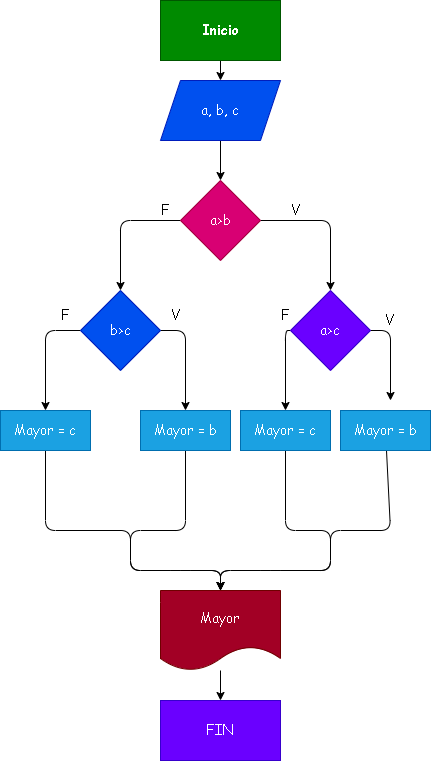

# Caso No. 2: Instrucciones condiciones
# Hallar el maoy de tres numeros enteros

# Analisis
Def. variables
a,b,c numeros enteros valores de entrada
mayor : El maoy entre a, b, c

## Diagrama de flujo

